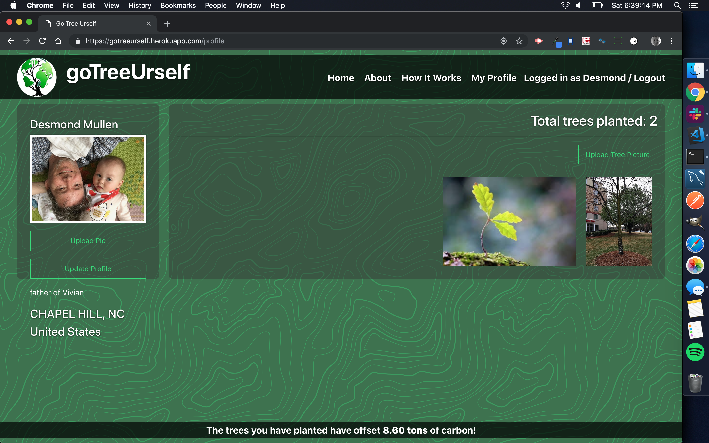

# goTreeUrself

**goTreeUrself is a site promoting the importance of planting trees to help renew resources lost to mass deforestation.** Encouraging people to plant a tree clearly has value but, for most people, it is an abstract idea. By putting "pins" on a map showing where others have planted trees, goTreeUrself encourages participation and lets users show the world trees they care about - either ones they have planted or ones that are important in their lives (e.g., "My grandfather planted this tree when he and grandmother got married"). Adding 15 "Famous Trees" (denoted by white arrows) gives another perspective on the environmental importance, historical importance, outsized lifespans and dimensions, and the wonder and beauty of the trees that surround us.

# Features
* Users can register and upload pictures of their own trees.
* Geotags embedded in uploaded pictures are used to locate the trees on the map.
* When geotag data is not available, we ask the user for the closest address to the tree. Users can enter as much or little location data as they prefer. We use that data to geocode and locate the tree on the map.
* Users can add a short biography statement about themselves and upload a profile picture if they like.
* Each tree can be cataloged with the date planted, a name or statement (e.g., "In memory of my father"), and the type of tree (e.g., elm, yew, pine, fir, etc.).

# Future enhancements
* We would like to encourage community among the users of this site by letting them search for other users/trees based on cohort (timeframe when tree was planted), or tree type, or even tags such as "Memorial", "Dedication", "Rare", "Fruit", etc.
* Presently, you can see a picture and basic information about any tree on the map. In future it would be nice to be able to visit other users' profile pages and even contact other like-minded users.

# Technologies
* Google Maps was central to our display of users' trees. We expanded the possibilities of basic markers by making the markers clickable to show infowindows and double-clickable to recenter and zoom-in. Each infowindow contains info about the tree and a click-to-enlarge picture. The Famous Trees contain links to Wikipedia pages giving more background on the trees.
* Filestack was used for photo upload to give a variety of ways for users to upload their pictures (from their device, from a link, from Facebook, etc.) and for us to extract any existing EXIF geotag data.
* Foundation and CSS Grid were used to arrange and style the front end.
* Node, Handlebars, Sequelize, mySQL2, and JawsDB were used and the site was deployed on Heroku.
* Sample data including user's names, username/passwords, profile pictures, tree names, planted-dates, and latitude/longitude locations were compiled using the randomUser API and latitude/longitude combinations were tested to see if they were on land using the geoNames API. We excluded Antarctic latitudes for, while they may be on land, we felt it was unlikely that many people would try planting trees there.
* A list of famous trees on MentalFloss.com was the inspiration and source of our plotting 15 famous trees.

### SCREENSHOTS:
01. The home page displays icons locating every tree in the database. In most cases, zooming in - and even using Google Maps' Street View - allows you to see exactly where a particular tree is:

02. A user's profile page allows them to upload pictures of trees they've planted or care for/care about along with a profile picture and short blurbs about themselves and the trees:

03. Clicking individual trees on the home page shows an infowindow with information about the tree. The white arrow icons were created by us - they are an assortment of famous trees around the world (oldest, tallest, etc.):

